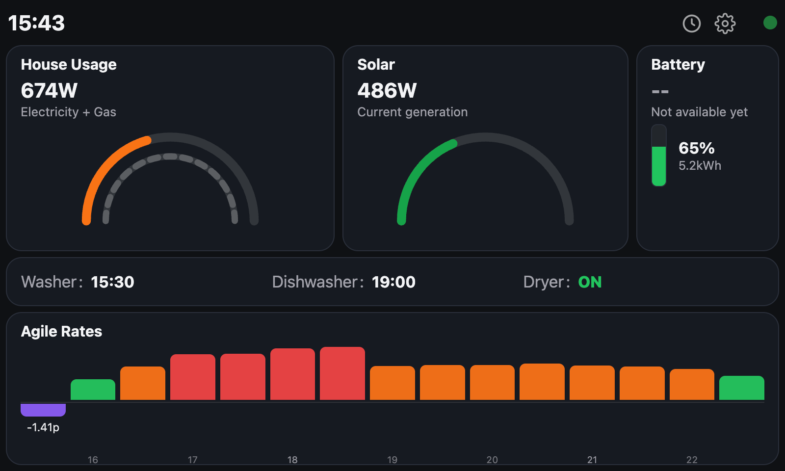

# ⚡ Home Energy Dashboard (IHD)

> Built for a dedicated always-on home display — fast, local-first, and
> energy-aware.

A lightweight, real-time home energy dashboard designed for a **5" 800×480
touchscreen**, combining:

- 🧠 Smart Octopus Agile pricing (dynamic window)
- 🔌 Live Home Assistant power usage
- ☀️ Solar generation monitoring
- 📊 Historical energy usage (day / week / month)
- ⚙️ Persistent user settings (local file-based)

Built with:
- 🦀 Rust backend (data + API + persistence)
- 🌐 Simple HTML/CSS/JS frontend (touch-first display)


## 📸 Features

### ⚡ Live Dashboard
- Real-time clock  
- House usage gauge (dynamic colour scaling)  
- Solar generation gauge (based on system max output)  
- Appliance status (washer / dishwasher / dryer)  
- Agile pricing chart (adaptive window size)  
- Auto-refresh every 10 seconds  

## 📸 Dashboard Preview



### 📊 History View
- Day view (30-minute slots)  
- Week view (daily totals)  
- Month view (daily totals)  
- Toggle between:
  - Cost (£)
  - kWh (future expansion)  


### ⚙️ Settings
- Adjustable Agile chart window:
  - 12 hours (24 slots)
  - 18 hours (36 slots)
  - 24 hours (48 slots)
- Persisted locally (`data/settings.json`)
- Applied instantly (no restart required)


## 🏗️ Architecture

```
Home Assistant  →  Rust Backend  →  Web UI
     (API)           (/api)        (Touch display)
                         ↓
                  Local storage
              (agile + history + settings)
```


## ⚙️ Setup

### 1. Clone the project

```bash
git clone <your-repo>
cd <your-repo>
```


### 2. Configure environment variables

Create a `.env` file:

```env
HOME_ASSISTANT_URL=http://homeassistant.local:8123
HOME_ASSISTANT_TOKEN=your_long_lived_access_token_here

OCTOPUS_API_KEY=your_sk_live_api_key_lives_here
OCTOPUS_ELECTRICITY_MPAN=your_mpan_lives_here
OCTOPUS_ELECTRICITY_SERIAL=your_electricity_meter_serial_number_lives_here
OCTOPUS_ELECTRICITY_STANDING_CHARGE_P_PER_DAY=your_electricity_standing_charge_lives_here
OCTOPUS_GAS_MPRN=your_gas_meter_mprn_lives_here
OCTOPUS_GAS_SERIAL=your_gas_meter_serial_number_lives_here
OCTOPUS_GAS_UNIT_RATE_P_PER_KWH=your_gas_per_kilowatt_charge_lives_here
OCTOPUS_GAS_STANDING_CHARGE_P_PER_DAY=your_gas_standing_charge_lives_here
OCTOPUS_GAS_CORRECTION_FACTOR=1.02264
OCTOPUS_GAS_CALORIFIC_VALUE=39.1
```


### 3. Run backend

```bash
cargo run
```


### 4. Open dashboard

```
http://localhost:3000
```


## 🔑 Home Assistant Token

Home Assistant → Profile → Security → Long-Lived Access Tokens


## 🔄 Data Sources

| Purpose        | Entity ID                              |
|----------------|----------------------------------------|
| House Usage    | `sensor.total_power_being_used`         |
| Solar Output   | `sensor.solar_panel_led_sensor_power`  |
| Appliances     | (derived from power usage thresholds)  |


## 💾 Data Storage

Stored locally under `/data`:

```
data/
├── agile/       # Agile pricing (daily JSON files)
├── history/     # Electricity + gas history
└── settings.json
```


## 💾 Historical Usage Data

The dashboard supports historical energy usage (day, week, and month views),
powered by data from the Octopus Energy API.

By default, only recent data (e.g. yesterday) is fetched automatically.  
To populate a longer history, you can run a manual backfill.


### 🔄 Backfilling History

You can fetch historical usage data using the included CLI tool:

```bash
cargo run --bin backfill_history -- 184
```

This will download **184 days (~6 months)** of historical data and store it
locally.


### 📁 Where Data Is Stored

All historical data is saved as JSON files under:

```
data/history/
```

These files are then used by the dashboard to render:

- 📅 Daily usage (30-minute slots)
- 📊 Weekly summaries
- 📈 Monthly summaries


### 🖥️ Where to Run It

You have two options:

**Option A — Run on the IHD device (recommended)**
- Run the command directly on your Raspberry Pi / IHD
- Data is immediately available to the dashboard

**Option B — Run on another machine**
- Run locally (e.g. laptop/desktop)
- Copy the resulting `data/history/` folder to the IHD device


### ⚠️ Notes

- Requires valid Octopus API credentials (configured in your environment)
- Backfilling large ranges may take a little time due to API limits
- Existing files will be reused where possible to avoid unnecessary re-fetching


### 🚀 Tip

A good starting point is:

```bash
cargo run --bin backfill_history -- 90
```

This gives you **3 months of history**, which is enough to make the history
charts immediately useful without long fetch times.


## 🔌 API Endpoints

| Endpoint                    | Description                     |
|----------------------------|--------------------------------|
| `/api/dashboard`           | Full dashboard state           |
| `/api/agile`               | Agile rolling window           |
| `/api/settings` (GET/POST) | Load / update settings         |
| `/api/history/day`         | Day history                    |
| `/api/history/week`        | Week history                   |
| `/api/history/month`       | Month history                  |


## 🚀 Roadmap

- Appliance scheduling recommendations (based on cheapest windows)  
- Battery integration (charge/discharge insight)  
- Cost forecasting (today / tomorrow projections)  
- Notifications / companion app  
- Advanced caching & performance tuning  


## 💡 Philosophy

> “Cost efficiency is great — simplicity should always win.”
